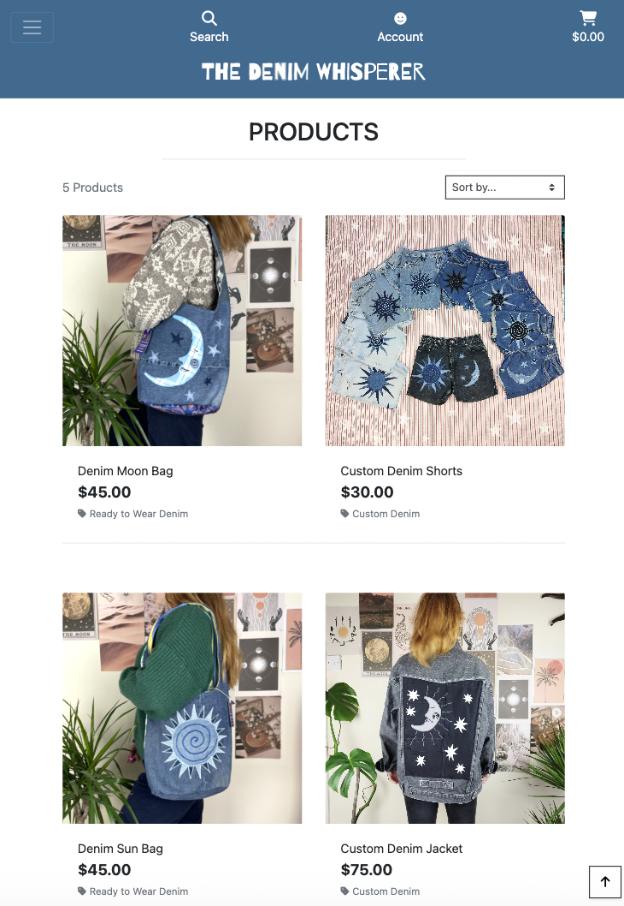
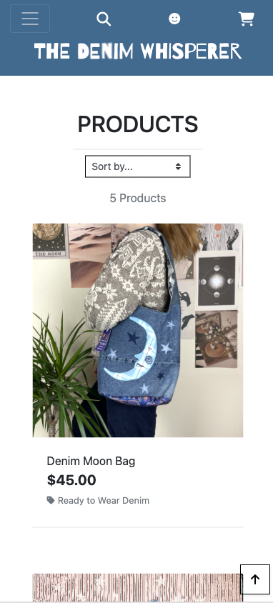
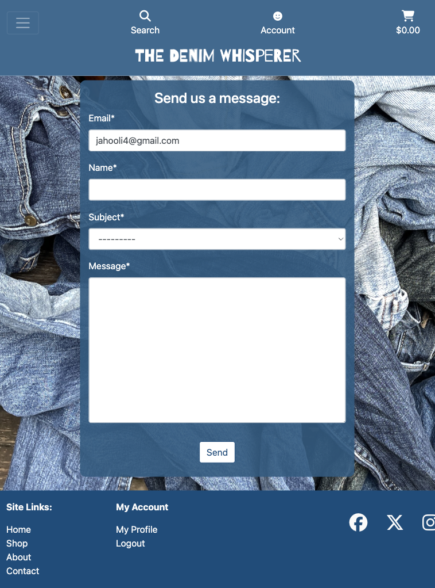
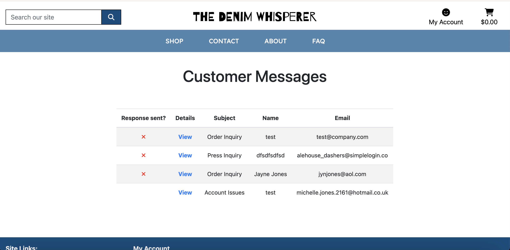
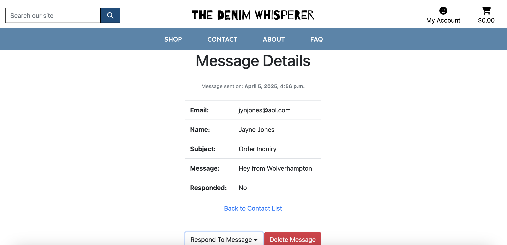
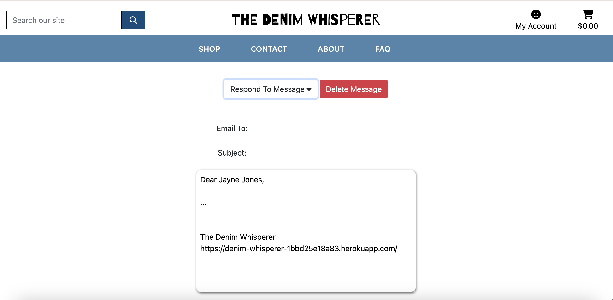
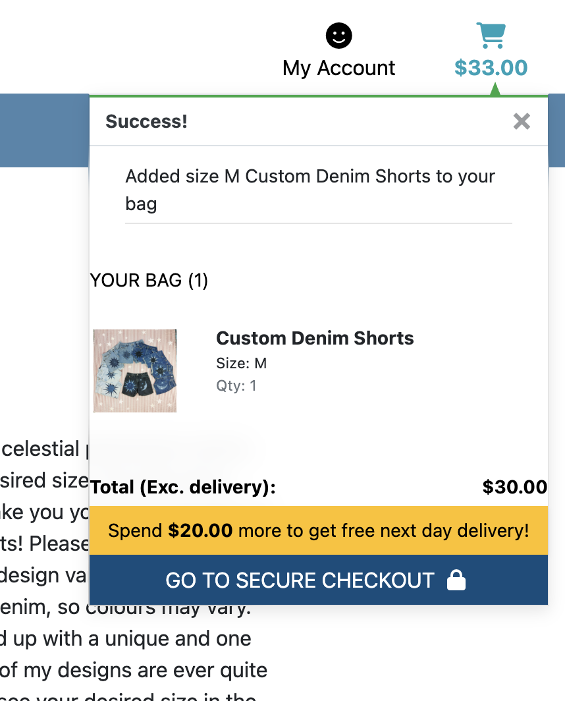
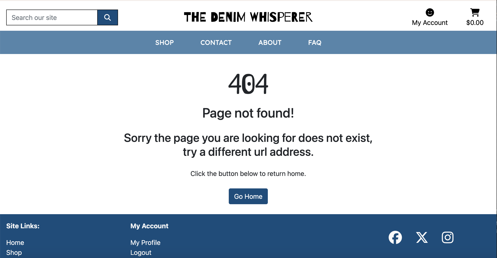
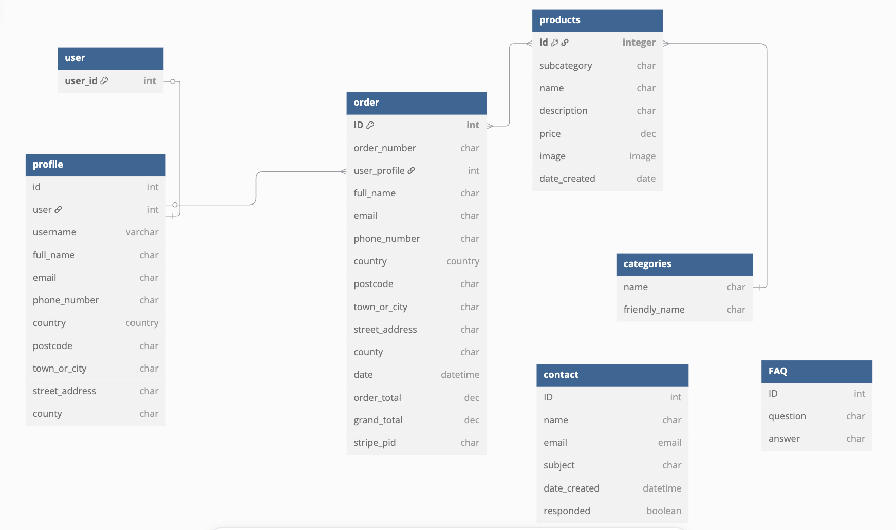

# The Denim Whisperer

[Live site](https://denim-whisperer-1bbd25e18a83.herokuapp.com/)


The Denim Whisperer is an online eccomerce site selling garments made from recycled denim.

## User Experience (UX)

After researching into similar existing sites I decided to opt for a simple, intuitive layout to maximise potential sales. I opted fot a colour pallette of different blues to give the site a denim theme.


## Fonts

- [Barrio](https://fonts.google.com/?query=barrio) was used for the site Logo.
- [Lexend](https://fonts.google.com/specimen/Lexend) was used for the site's main content.

## User stories

User stories can be found [here](https://github.com/users/Jahooli4/projects/5/views/1) via my gitHub project.

## Wireframes
### Home:

### Shop:

### Product detail:

### Sign up:

### Bag:


## User stories

User stories can be found [here](https://github.com/users/Jahooli4/projects/5) via my gitHub project.

## Existing Features - Scope plane:
### Home page
The landing page for the Denim Whisperer is simple and clean with intuitive navigation. A hero image offers an insight into the sort of products for sale and the Shop now button will send users straight to the product page


### Nav bar
The Nav bar features links to all site pages, it is fully responsive and adjusts based on device size to just a menu of icons. Above this you can access the account dropdown menu, the links in which change depending on whether the user is logged in or not, a general user or admin. There is also a search bar and shopping basket link.


### Footer section
The footer section contains all relevant site and social media links. Account links are displayed for logged in users.


### Shop/Products page
The products page features a clean and simple layout making it easy for users to browse. The grid layour of products is responsive allowing the preview images to remain a good, visible size on all devices.





### Product detail page
The product detail page features all the essential info a user could wish to know before buying an item. This includes a photo gallery, price, description, size category and quantity selection buttons. The page features an add to basket button as welll as a 'back to products' button.


### ADMIN ONLY - Product detail CRUD:
The product detail page also displays the edit/delete buttons for admin users. The delete button takes the user to an 'are you sure you want to delte' page to avoid accidental deletions and the edit button displays the product management form where the admin may edit or update the product details.


### Contact page
The contact page features a form that users may fill out to contact the site owner. The form submits to a database that can only be accessed by admin users.




### ADMIN ONLY - Customer enquiry list
Visible only to admin, this page displays the list of contact requests submitted by users to the site user. As an admin user you are able to reply to the user's query using the form. Upon submission the form sends an email back to the user.






### About page
The about page contains information about the purpose of the site and the shop ethos. I have decided to set the background to an image of denim to tie in with the theme of the site.


### FAQ page
The FAQ page contains a list of frequently asked questions and answers. The FAQ is displayed in an accordian style dropdown.


### Registration page
The registration page consists of a crispy form with relevent fields the user must fill out to create an account on the site. Upon submission, the form sends the user a validation email allowing the user to click a link and then log in using their details. This prevents any spam bots creating fake accounts.


### Profile
The profile page shows the user their current details and a list of previous orders.


### Sign in
Simple form allowing users to sign into their account.


### Sign out
Confirms users havent clicked the sign out button accidentally.


### Add to bag 
When a user adds a product to their shopping bag a toast is displayed with a preview of their bag contents and running subtotal.



### Bag page
The shopping bag page shows the user all the items they currently have in their bag, aswell as the total and shipping costs. The images of the items do not display on smaller screen sizes in order to allow the important information to remain legible.


### Checkout page
Provides the user with a form to fill out with their shipping and billing information including the debit/credit card they will use for payment.


### Checkout success page
Confirms to the user that their order has been successfully placed. The page lists the items the user has ordered as well as the user's details for reference.


### Custom error pages
I have styled some custom error pages that display for the user, rather that generic ones. This keeps the style continuity of the site.



## Future features

### Newsletter subscription
I would like to add an email newsletter service for users to be able to sign up to so they can stay up to date with the latest offers from the shop.

### Custom confirmation emails
Given more time I would like to have added my own styled templates for the email confirmation emails.

### Shipping options
I think it would be a good additional feature to add a shipping API of sorts to my store to allow users to sellect from different shipping providers. They could also be given a shipping price based on the calculated weight of their order and not just a flat rate. 

## Database design
During the planning stages of this project I made an Entity Relationship Diagram to help visualise the database models and the way they relate to one another.



## Testing

Find my full testing file [here](TESTING.md) file.

## Deployment
### ElephantSQL Database

This project uses [ElephantSQL](https://www.elephantsql.com) for the PostgreSQL Database.

To obtain your own Postgres Database, sign-up with your GitHub account, then follow these steps:
- Click **Create New Instance** to start a new database.
- Provide a name (this is commonly the name of the project: denim_whisperer).
- Select the **Tiny Turtle (Free)** plan.
- You can leave the **Tags** blank.
- Select the **Region** and **Data Center** closest to you.
- Once created, click on the new database name, where you can view the database URL and Password.

### Stripe API

This project uses [Stripe](https://stripe.com) to handle the ecommerce payments.

Once you've created a Stripe account and logged-in, follow these series of steps to get your project connected.

- From your Stripe dashboard, click to expand the "Get your test API keys".
- You'll have two keys here:
	- `STRIPE_PUBLIC_KEY` = Publishable Key (starts with **pk**)
	- `STRIPE_SECRET_KEY` = Secret Key (starts with **sk**)

As a backup, in case users prematurely close the purchase-order page during payment, we can include Stripe Webhooks.

- From your Stripe dashboard, click **Developers**, and select **Webhooks**.
- From there, click **Add Endpoint**.
	- `https://denim-whisperer-1bbd25e18a83.herokuapp.com/`
- Click **receive all events**.
- Click **Add Endpoint** to complete the process.
- You'll have a new key here:
	- `STRIPE_WH_SECRET` = Signing Secret (Wehbook) Key (starts with **wh**)

### Gmail API

This project uses [Gmail](https://mail.google.com) to handle sending emails to users for account verification and purchase order confirmations.

Once you've created a Gmail (Google) account and logged-in, follow these series of steps to get your project connected.

- Click on the **Account Settings** (cog icon) in the top-right corner of Gmail.
- Click on the **Accounts and Import** tab.
- Within the section called "Change account settings", click on the link for **Other Google Account settings**.
- From this new page, select **Security** on the left.
- Select **2-Step Verification** to turn it on. (verify your password and account)
- Once verified, select **Turn On** for 2FA.
- Navigate back to the **Security** page, and you'll see a new option called **App passwords**.
- This might prompt you once again to confirm your password and account.
- Select **Mail** for the app type.
- Select **Other (Custom name)** for the device type.
	- Any custom name, such as "Django" or denim_whisperer
- You'll be provided with a 16-character password (API key).
	- Save this somewhere locally, as you cannot access this key again later!
	- `EMAIL_HOST_PASS` = user's 16-character API key
	- `EMAIL_HOST_USER` = user's own personal Gmail email address

### Cloudinary API

This project uses the [Cloudinary API](https://cloudinary.com) to store media assets online, due to the fact that Heroku doesn't persist this type of data.

To obtain your own Cloudinary API key, create an account and log in.
- For *Primary interest*, you can choose *Programmable Media for image and video API*.
- Optional: *edit your assigned cloud name to something more memorable*.
- On your Cloudinary Dashboard, you can copy your **API Environment Variable**.
- Be sure to remove the `CLOUDINARY_URL=` as part of the API **value**; this is the **key**.

### Heroku Deployment

This project uses [Heroku](https://www.heroku.com), a platform as a service (PaaS) that enables developers to build, run, and operate applications entirely in the cloud.

Deployment steps are as follows, after account setup:

- Select **New** in the top-right corner of your Heroku Dashboard, and select **Create new app** from the dropdown menu.
- Your app name must be unique, and then choose a region closest to you (EU or USA), and finally, select **Create App**.
- From the new app **Settings**, click **Reveal Config Vars**, and set your environment variables.

| Key | Value |
| --- | --- |
| `CLOUDINARY_URL` | user's own value |
| `DATABASE_URL` | user's own value |
| `DISABLE_COLLECTSTATIC` | 1 (*this is temporary, and can be removed for the final deployment*) |
| `SECRET_KEY` | user's own value |

Heroku needs two additional files in order to deploy properly.
- requirements.txt
- Procfile

You can install this project's **requirements** (where applicable) using:
- `pip3 install -r requirements.txt`

If you have your own packages that have been installed, then the requirements file needs updated using:
- `pip3 freeze --local > requirements.txt`

The **Procfile** can be created with the following command:
- `echo web: gunicorn app_name.wsgi > Procfile`
- *replace **app_name** with the name of your primary Django app name; the folder where settings.py is located*

For Heroku deployment, follow these steps to connect your own GitHub repository to the newly created app:

Either:
- Select **Automatic Deployment** from the Heroku app.

Or:
- In the Terminal/CLI, connect to Heroku using this command: `heroku login -i`
- Set the remote for Heroku: `heroku git:remote -a app_name` (replace *app_name* with your app name)
- After performing the standard Git `add`, `commit`, and `push` to GitHub, you can now type:
	- `git push heroku main`

The project should now be connected and deployed to Heroku!

### Local Deployment

This project can be cloned or forked in order to make a local copy on your own system.

For either method, you will need to install any applicable packages found within the *requirements.txt* file.
- `pip3 install -r requirements.txt`.

You will need to create a new file called `env.py` at the root-level,
and include the same environment variables listed above from the Heroku deployment steps.

Sample `env.py` file:

```python
import os

os.environ.setdefault("CLOUDINARY_URL", "user's own value")
os.environ.setdefault("DATABASE_URL", "user's own value")
os.environ.setdefault("SECRET_KEY", "user's own value")

# local environment only (do not include these in production/deployment!)
os.environ.setdefault("DEBUG", "True")
```

Once the project is cloned or forked, in order to run it locally, you'll need to follow these steps:
- Start the Django app: `python3 manage.py runserver`
- Stop the app once it's loaded: `CTRL+C` or `⌘+C` (Mac)
- Make any necessary migrations: `python3 manage.py makemigrations`
- Migrate the data to the database: `python3 manage.py migrate`
- Create a superuser: `python3 manage.py createsuperuser`
- Load fixtures (if applicable): `python3 manage.py loaddata file-name.json` (repeat for each file)
- Everything should be ready now, so run the Django app again: `python3 manage.py runserver`

#### Cloning

You can clone the repository by following these steps:

1. Go to the [GitHub repository](https://github.com/Jahooli4/denim_whisperer) 
2. Locate the Code button above the list of files and click it 
3. Select if you prefer to clone using HTTPS, SSH, or GitHub CLI and click the copy button to copy the URL to your clipboard
4. Open Git Bash or Terminal
5. Change the current working directory to the one where you want the cloned directory
6. In your IDE Terminal, type the following command to clone my repository:
	- `git clone https://github.com/Jahooli4/denim_whisperer`
7. Press Enter to create your local clone.

Alternatively, if using Gitpod, you can click below to create your own workspace using this repository.

[Open in Gitpod](hhttps://github.com/Jahooli4/denim_whisperer)

Please note that in order to directly open the project in Gitpod, you need to have the browser extension installed.
A tutorial on how to do that can be found [here](https://www.gitpod.io/docs/configure/user-settings/browser-extension).

#### Forking

By forking the GitHub Repository, we make a copy of the original repository on our GitHub account to view and/or make changes without affecting the original owner's repository.
You can fork this repository by using the following steps:

1. Log in to GitHub and locate the [GitHub Repository](https://github.com/Jahooli4/denim_whisperer)
2. At the top of the Repository (not top of page) just above the "Settings" Button on the menu, locate the "Fork" Button.
3. Once clicked, you should now have a copy of the original repository in your own GitHub account!


## Languages Used:
- HTML used for the main site content.
- CSS used for the main site design and layout.
- JavaScript used for user interaction on the site.
- Python used as the back-end programming language.

## Technologies Used:
- [Git](https://git-scm.com) used for version control. (`git add`, `git commit`, `git push`)
- [GitHub](https://github.com) used for secure online code storage.
- [Gitpod](https://gitpod.io) used as a cloud-based IDE for development.
- [Bootstrap](https://getbootstrap.com) used as the front-end CSS framework for modern responsiveness and pre-built components.
- [Django](https://www.djangoproject.com) used as the Python framework for the site.
- [PostgreSQL](https://www.postgresql.org) used as the relational database management.
- [ElephantSQL](https://www.elephantsql.com) used as the Postgres database.
- [Heroku](https://www.heroku.com) used for hosting the deployed site.
- [Cloudinary](https://cloudinary.com) used for online static file storage.
- [Pillow](https://pypi.org/project/Pillow/) used for image processing
- [Gunicorn](https://gunicorn.org/) used for WSGI server
- [Coolers](https://coolors.co/fafafa-333333-6e2937-993e50-f3baba-507e50-507948-304f2a-263e21)
- [Font awesome](https://fontawesome.com/)
- [amiresponsive](https://ui.dev/amiresponsive)
- [google fonts](https://fonts.google.com/)
- [Stripe](https://stripe.com) used for online secure payments of ecommerce products/services.
- [Crispy Forms](https://django-crispy-forms.readthedocs.io/en/latest/) used for auto-formatting of front-end forms

## Credits

### Content


| Source | Location | Notes |
| --- | --- | --- |
| [Markdown Builder](https://tim.2bn.dev/markdown-builder) | README and TESTING | to generate the Markdown files |
| [StackOverflow](https://stackoverflow.com/questions/3578882) | Django Authentication | Using redirect url in django |
| [Bootstrap Components](https://getbootstrap.com/docs/5.3/examples/) | entire site | Bootstrap stock components used as a base for some site features |
| [Boutique Ado](https://github.com/Code-Institute-Solutions/boutique_ado_v1) | entire site | Various code sections taken from the CI Boutique Ado Walkthrough Project |
| [Lewis Dillon ](https://github.com/LewisMDillon/web-piano-academy/tree/main) | Contact page | inspiration taken from the contact models and reply feature|
| [Microsoft](https://learn.microsoft.com/en-us/ef/core/modeling/relationships/many-to-many) | entire site | Model relationships |
| [Geek For Geeks](https://www.geeksforgeeks.org/relationships-in-sql-one-to-one-one-to-many-many-to-many/) | entire site | Model relationships |
| [Django documentation](https://docs.djangoproject.com/en/4.2/ref/templates/builtins/#ref-templates-builtins-tags) | entire site | Using django |

### Photos

All photos are my own, from my business [Jahooli](Jahooli.co.uk)

except for one denim photo:
[About background](https://www.oxfam.org.uk/oxfam-in-action/oxfam-blog/denim-through-the-decades/)

### Content 

| [Jahooli](jahooli.co.uk) | entire site | Photos and descriptions |
| [Denim facts](https://kingsofindigo.com/blogs/news/the-story-of-denim-5-fun-facts-you-didn-t-know?srsltid=AfmBOoqqh173rRZHNLPVvrg8GI05cwnVZpNW9xmDjdsbSmXcd7FHUmpb) | about page | Denim facts |

### Acknowledgements

I would like to thank my mentor Rory Patrick Sheridan for his support throughout the course.