# The Denim Whisperer

[Live site](https://denim-whisperer-1bbd25e18a83.herokuapp.com/)

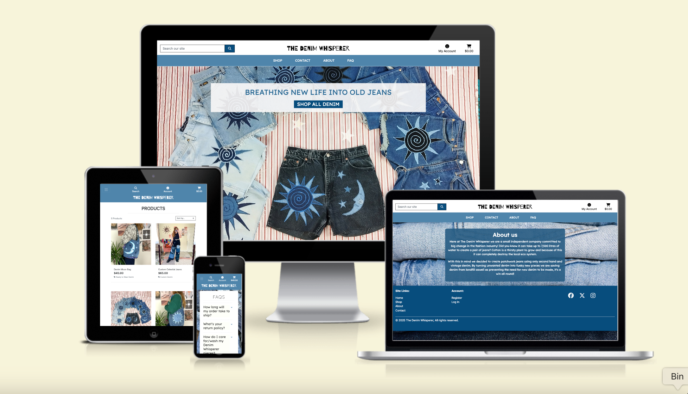

The Denim Whisperer is an online eccomerce site selling garments made from recycled denim.

## User Experience (UX)

After researching into similar existing sites I decided to opt for a simple, intuitive layout to maximise potential sales. I opted fot a colour pallette of different blues to give the site a denim theme.

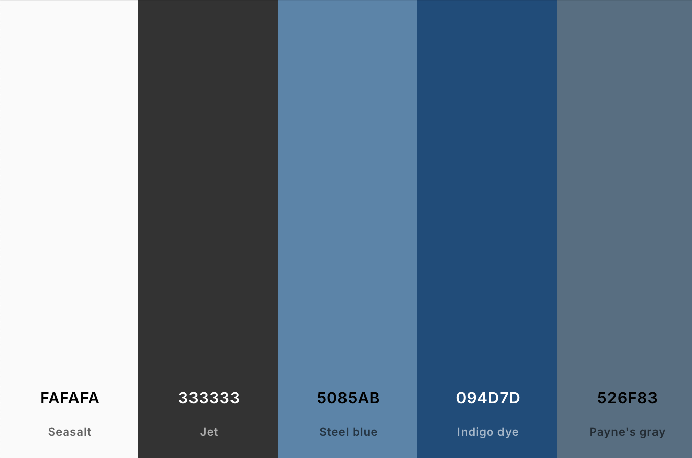

## Fonts

- [Barrio](https://fonts.google.com/?query=barrio) was used for the site Logo.
- [Lexend](https://fonts.google.com/specimen/Lexend) was used for the site's main content.

## User stories

User stories can be found [here](https://github.com/users/Jahooli4/projects/5/views/1) via my gitHub project.

## Wireframes
### Home:

### Shop:

### Product detail:

### Sign up:

### Bag:

## Existing Features - Scope plane:
### Home page
The landing page for the Denim Whisperer is simple and clean with intuitive navigation. A hero image offers an insight into the sort of products for sale and the Shop now button will send users straight to the product page

### Nav bar
The Nav bar features links to all site pages, it is fully responsive and adjusts based on device size to just a menu of icons. Above this you can access the account dropdown menu, the links in which change depending on whether the user is logged in or not, a general user or admin. There is also a search bar and shopping basket link.

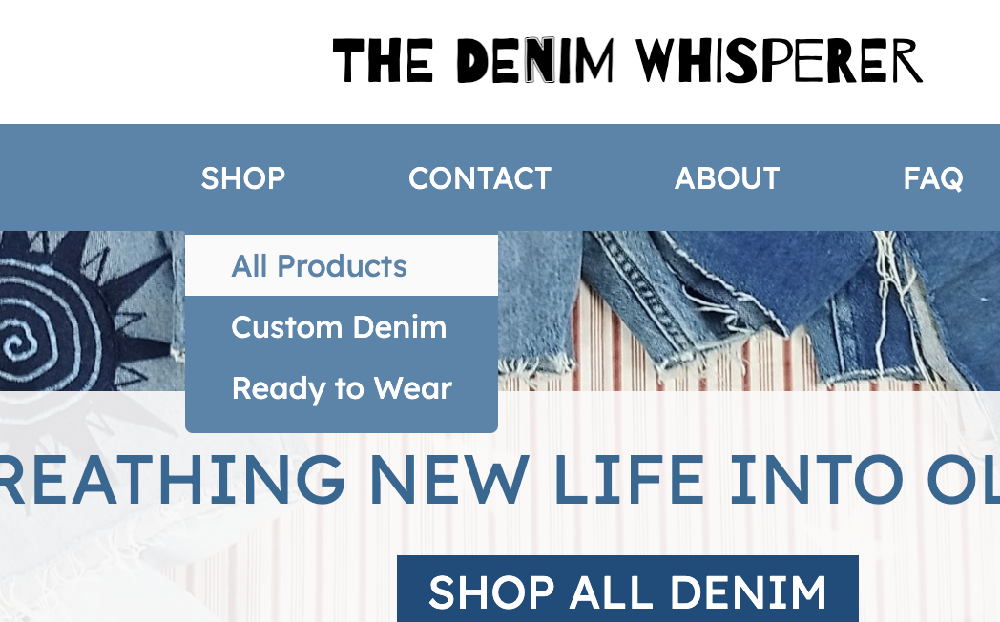

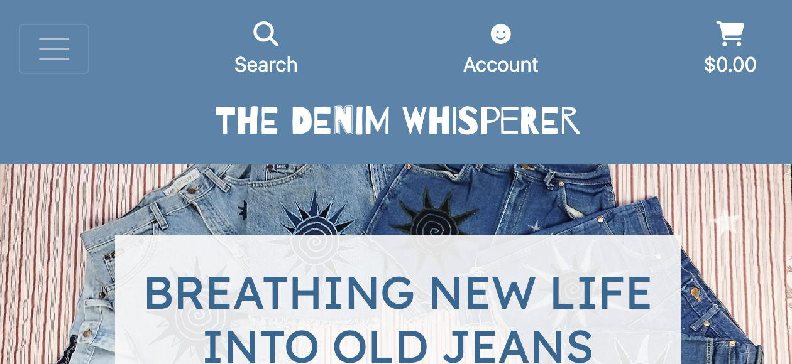

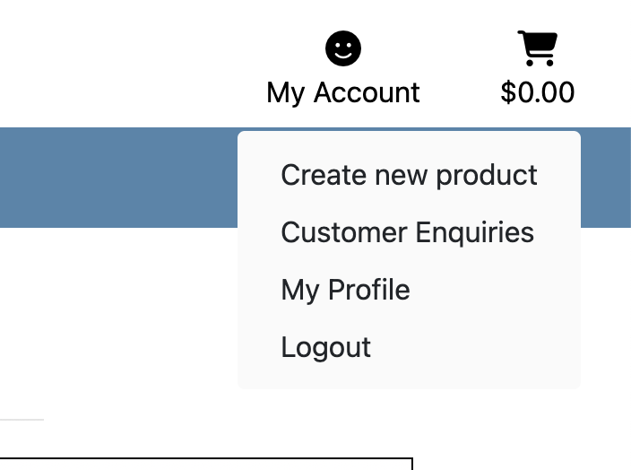

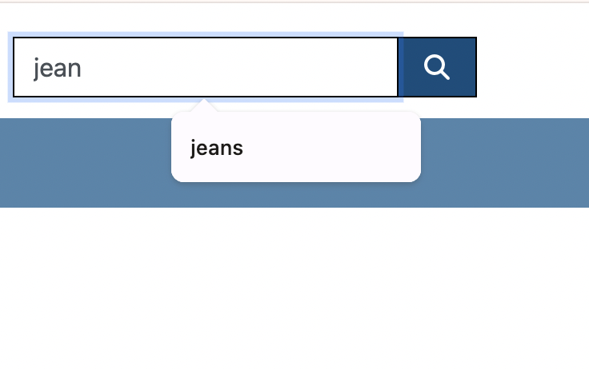

### Footer section
The footer section contains all relevant site and social media links. Account links are displayed for logged in users.

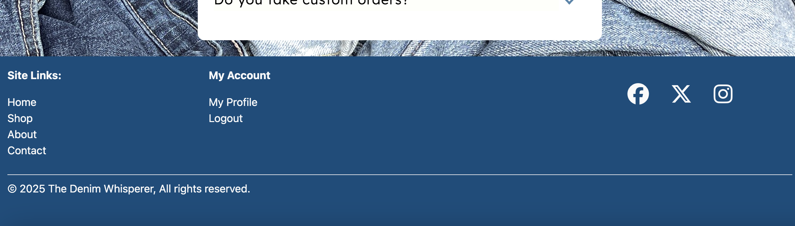

### Shop/Products page
The products page features a clean and simple layout making it easy for users to browse. The grid layour of products is responsive allowing the preview images to remain a good, visible size on all devices.

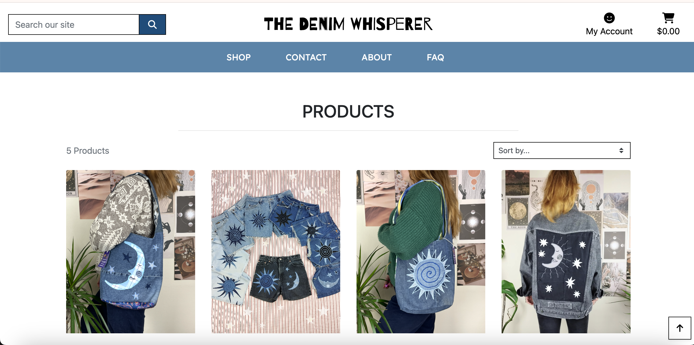

### Product detail page
The product detail page features all the essential info a user could wish to know before buying an item. This includes a photo gallery, price, description, size category and quantity selection buttons. The page features an add to basket button as welll as a 'back to products' button.

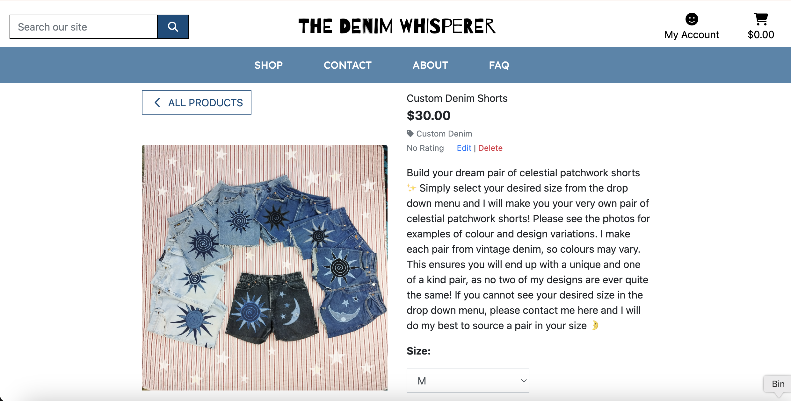

The product detail page also displays the edit/delete buttons for admin users. The delete button takes the user to an 'are you sure you want to delte' page to avoid accidental deletions and the edit button displays the product management form where the admin may edit or update the product details.

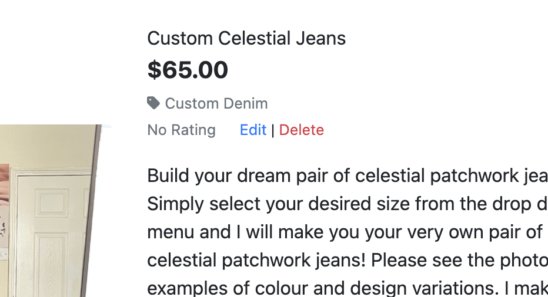
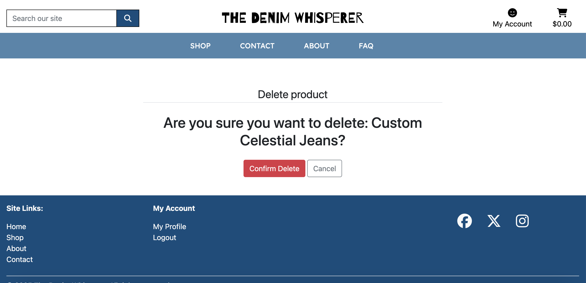

### Contact page
The contact page features a form that users may fill out to contact the site owner. The form submits to a database that can only be accessed by admin users.

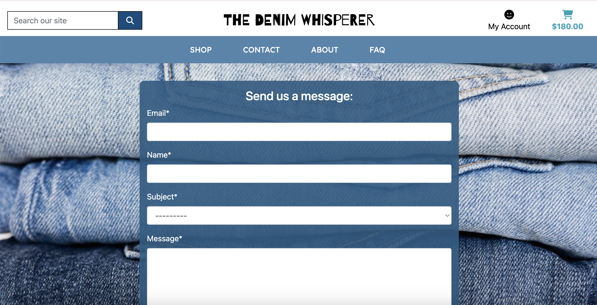

### Customer enquiry list
Visible only to admin, this page displays the list of contact requests submitted by users to the site user. As an admin user you are able to reply to the user's query using the form. Upon submission the form sends an email back to the user.

### About page
The about page contains information about the purpose of the site and the shop ethos. I have decided to set the background to an image of denim to tie in with the theme of the site.

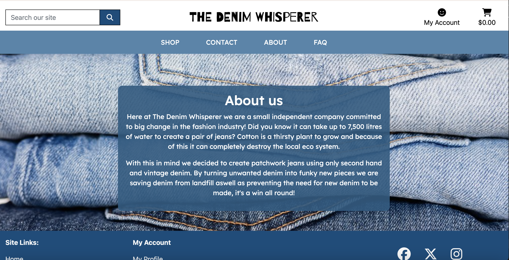

### FAQ page
The FAQ page contains a list of frequently asked questions and answers. The FAQ is displayed in an accordian style dropdown.

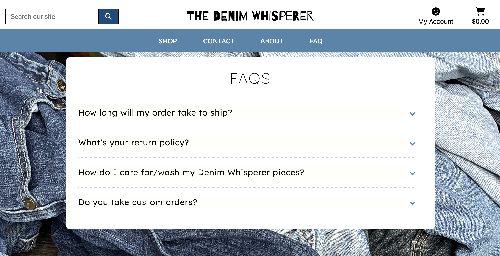

### Registration page
The registration page consists of a crispy form with relevent fields the user must fill out to create an account on the site. Upon submission, the form sends the user a validation email allowing the user to click a link and then log in using their details. This prevents any spam bots creating fake accounts.

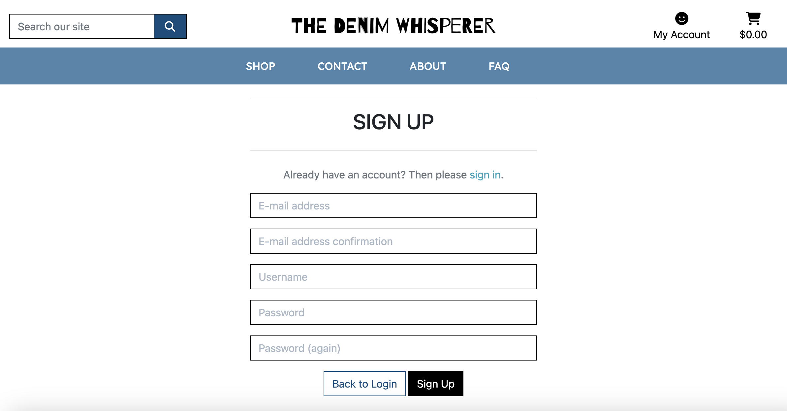

### Profile
The profile page shows the user their current details and a list of previous orders.

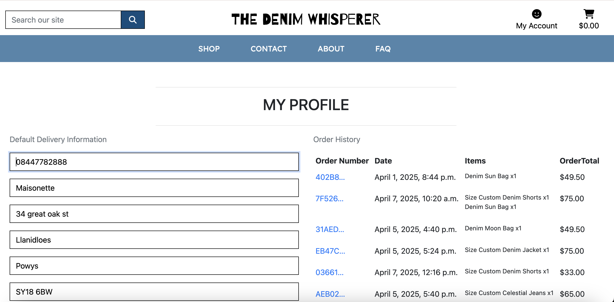

### Sign in
Simple form allowing users to sign into their account.

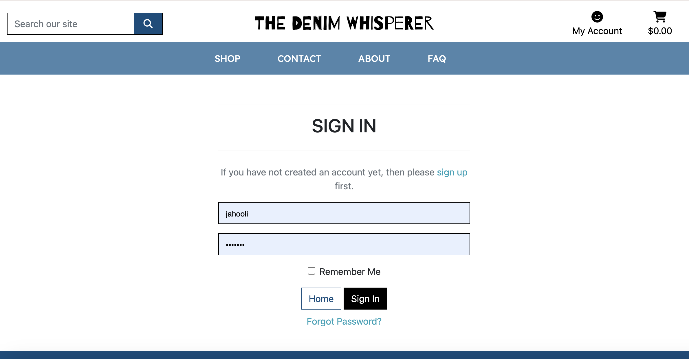

### Sign out
Confirms users havent clicked the sign out button accidentally.

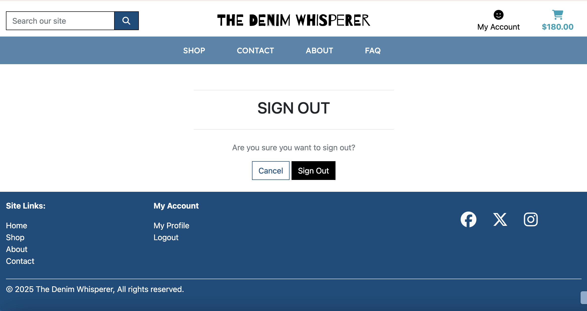

### Add to bag 
When a user adds a product to their shopping bag a toast is displayed with a preview of their bag contents and running subtotal.

### Bag page
The shopping bag page shows the user all the items they currently have in their bag, aswell as the total and shipping costs. The images of the items do not display on smaller screen sizes in order to allow the important information to remain legible.

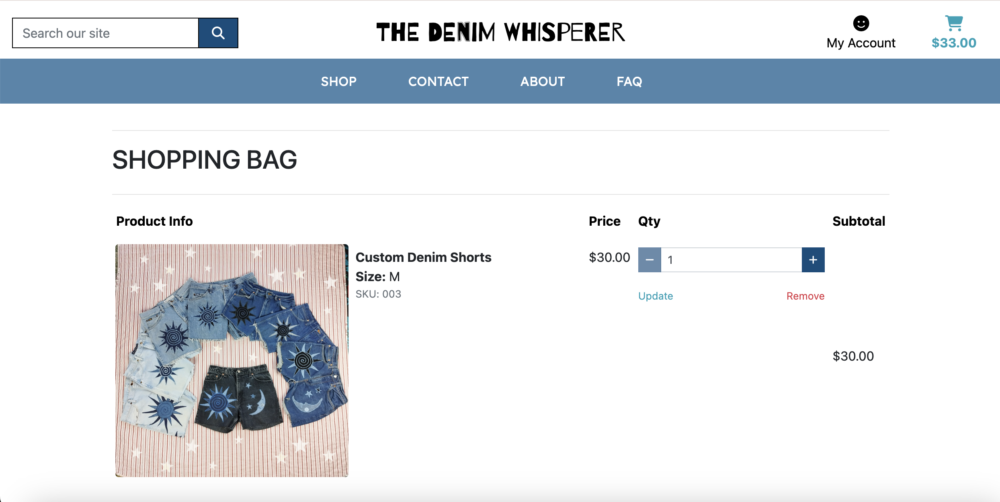

### Checkout page
Provides the user with a form to fill out with their shipping and billing information including the debit/credit card they will use for payment.

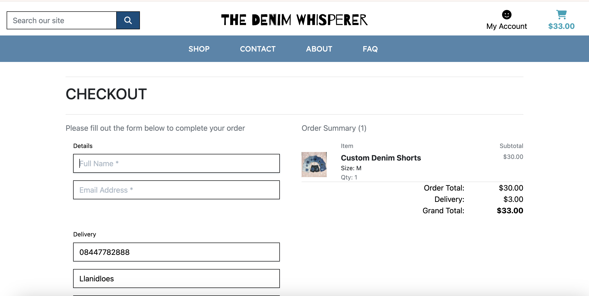

### Checkout success page
Confirms to the user that their order has been successfully placed. The page lists the items the user has ordered as well as the user's details for reference.

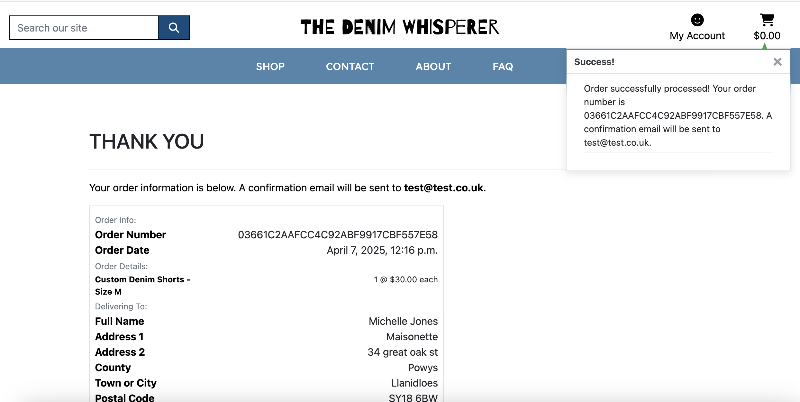

