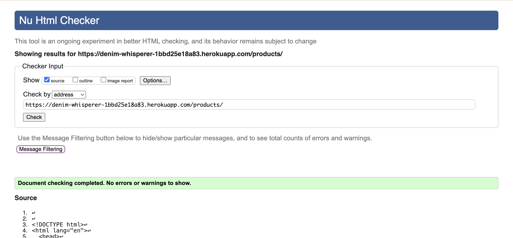
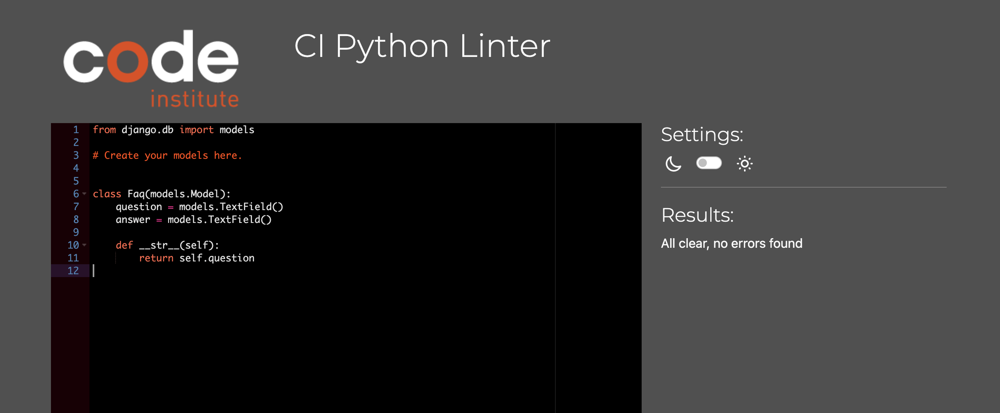
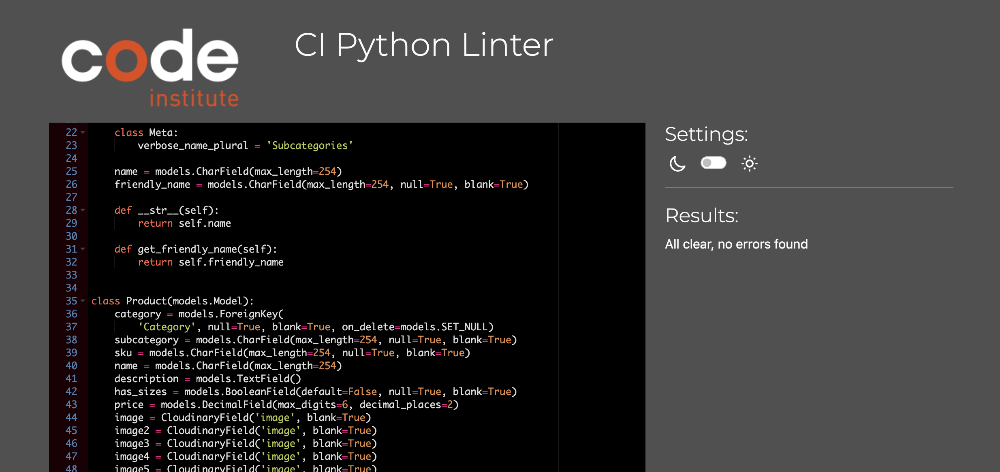
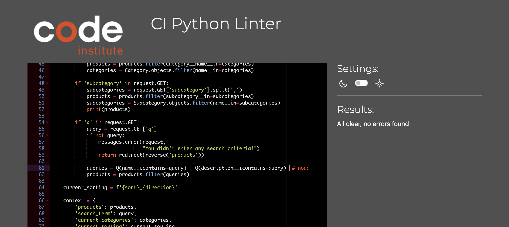
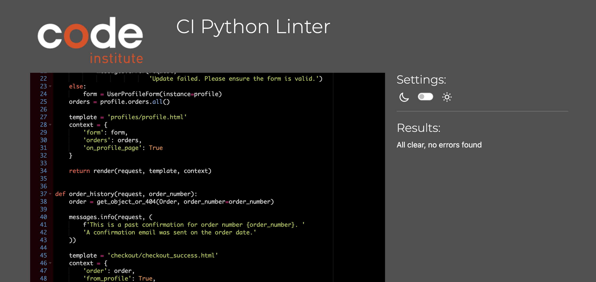
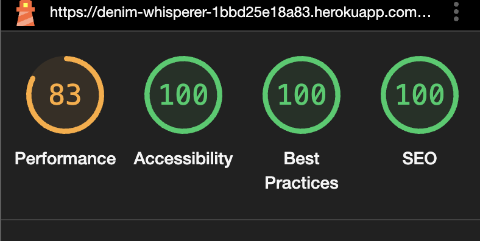
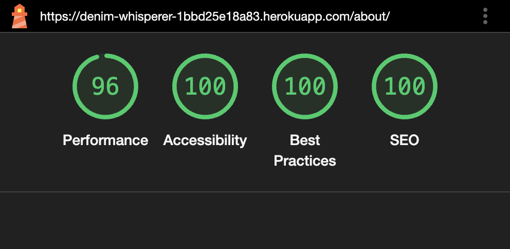

# Testing

Return back to the [README.md](README.md) file.

## Code Validation

### HTML

I have used the [HTML W3C Validator](https://validator.w3.org) to validate all of my HTML files.

| Page | W3C URL | Screenshot | Notes |
| --- | --- | --- | --- |
| about |  | Pass: No Errors |
| add-product |  | Pass: No Errors |
| bag |  | Pass: No Errors |
| checkout |  | Pass: No Errors |
| checkout-success |  | Pass: No Errors |
| contact-list |  | Pass: No Errors |
| contact-update-form |  | Pass: No Errors |
| contact |  | Pass: No Errors |
| delete-product |  | Pass: No Errors |
| edit-product |  | Pass: No Errors |
| faq |  | Pass: No Errors |
| home |  | Pass: No Errors |
| login |  | Pass: No Errors |
| logout |  | Pass: No Errors |
| product-detail |  | Pass: No Errors |
| products |  | Pass: No Errors |
| profile |  | Pass: No Errors |
| register |  | Pass: No Errors |

### CSS

I have used [CSS Jigsaw Validator](https://jigsaw.w3.org/css-validator) to validate all of my CSS files.

| File | Jigsaw URL | Screenshot | Notes |
| --- | --- | --- | --- |
| basee.css |  | Pass: No Errors |
| checkout.css |  | Pass: No Errors |
| login.css |  | Pass: No Errors |
| profile.css |  | Pass: No Errors |

### JavaScript

I have used [JShint Validator](https://jshint.com) to validate all of my JS files.

| File | Screenshot | Notes |
| --- | --- | --- |
| stripe_elements.js |  | Pass: No errors |
| countryfield.js |  | Pass: No Errors |

### Python

I have used [PEP8 CI Python Linter](https://pep8ci.herokuapp.com/) to validate all of my Python files.

#### ABOUT APP
| File | Screenshot | Notes |
| --- | --- | --- |
| apps.py |  | Pass: No errors |
| urls.py |  | Pass: No Errors |
| urls.py |  | Pass: No Errors |

#### BAG APP
| File | Screenshot | Notes |
| --- | --- | --- |
| apps.py |  | Pass: No Errors |
| contexts.py |  | Pass: No Errors |
| urls.py |  | Pass: No Errors |
| views.py |  | Pass: No Errors |

#### CHECKOUT APP
| File | Screenshot | Notes |
| --- | --- | --- |
| admin.py |  | Pass: No Errors |
| apps.py |  | Pass: No Errors |
| forms.py |  | Pass: No Errors |
| models.py |  | Pass: No Errors |
| signals.py |  | Pass: No Errors |
| urls.py |  | Pass: No Errors |
| views.py |  | Pass: No Errors |
| webhook_handlers.py |  | Pass: No Errors |
| webhooks.py |  | Pass: No Errors |

#### CONTACT APP
| File | Screenshot | Notes |
| --- | --- | --- |
| admin.py |  | Pass: No Errors |
| apps.py |  | Pass: No Errors |
| models.py |  | Pass: No Errors |
| urls.py |  | Pass: No Errors |
| views.py |  | Pass: No Errors |

#### DENIM_WHISPERER APP
| File | Screenshot | Notes |
| --- | --- | --- |
| asgi.py |  | Pass: No Errors |
| settings.py |  | Pass: No Errors |
| urls.py |  | Pass: No Errors |
| wsgi.py |  | Pass: No Errors |

#### FAQ APP
| File | Screenshot | Notes |
| --- | --- | --- |
| admin.py |  | Pass: No Errors |
| apps.py |  | Pass: No Errors |
| models.py |  | Pass: No Errors |
| urls.py |  | Pass: No Errors |
| views.py |  | Pass: No Errors |

#### HOME APP
| File | Screenshot | Notes |
| --- | --- | --- |
| apps.py |  | Pass: No Errors |
| urls.py |  | Pass: No Errors |
| views.py |  | Pass: No Errors |

#### PRODUCTS APP
| File | Screenshot | Notes |
| --- | --- | --- |
| admin.py |  | Pass: No Errors |
| apps.py |  | Pass: No Errors |
| forms.py |  | Pass: No Errors |
| models.py |  | Pass: No Errors |
| urls.py |  | Pass: No Errors |
| views.py |  | Pass: No Errors |

#### PROFILES APP
| File | Screenshot | Notes |
| --- | --- | --- |
| apps.py |  | Pass: No Errors |
| forms.py |  | Pass: No Errors |
| models.py |  | Pass: No Errors |
| urls.py |  | Pass: No Errors |
| views.py |  | Pass: No Errors |

## Lighthouse testing

I have tested my deployed site using the Lighthouse Audit tool.

On all pages, Lighthouse is flagging a warning 'Issues were logged in the Issues panel in Chrome Devtools'. This is caused by the built-in Stripe element used by the site.

| Page | Screenshot | Notes |
| --- | --- | --- |
| Home |  | Minor Warnings |
| Products |  | Minor Warnings |
| Product detail |  | Minor Warnings |
| Product add |  | Minor Warnings |
| Product delete |  | Minor Warnings |
| About |  | Minor Warnings |
| Contact |  | Minor Warnings |
| Customer enquiries |  | Minor Warnings |
| Delete message |  | Minor Warnings |
| FAQ |  | Minor Warnings |
| Register |  | Minor Warnings |
| Login |  | Minor Warnings |
| Logout |  | Minor Warnings |
| Bag |  | Minor Warnings |
| Checkout success |  | Minor Warnings |