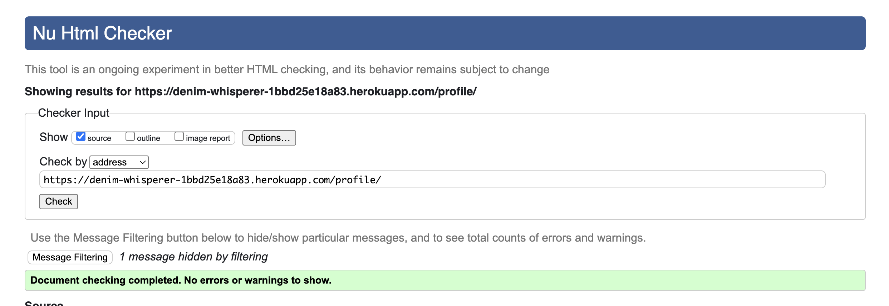

# Testing

Return back to the [README.md](README.md) file.

## Code Validation

### HTML

I have used the [HTML W3C Validator](https://validator.w3.org) to validate all of my HTML files.

| Page | W3C URL | Screenshot | Notes |
| --- | --- | --- | --- |
| about |  | Pass: No Errors |
| add-product |  | Pass: No Errors |
| bag |  | Pass: No Errors |
| checkout |  | Pass: No Errors |
| checkout-success |  | Pass: No Errors |
| contact-list |  | Pass: No Errors |
| contact-update-form |  | Pass: No Errors |
| contact |  | Pass: No Errors |
| delete-product |  | Pass: No Errors |
| edit-product |  | Pass: No Errors |
| faq |  | Pass: No Errors |
| home |  | Pass: No Errors |
| login |  | Pass: No Errors |
| logout |  | Pass: No Errors |
| product-detail |  | Pass: No Errors |
| products |  | Pass: No Errors |
| profile |  | Pass: No Errors |
| register |  | Pass: No Errors |

### CSS

I have used [CSS Jigsaw Validator](https://jigsaw.w3.org/css-validator) to validate all of my CSS files.

| File | Jigsaw URL | Screenshot | Notes |
| --- | --- | --- | --- |
| basee.css |  | Pass: No Errors |
| checkout.css |  | Pass: No Errors |
| login.css |  | Pass: No Errors |
| profile.css |  | Pass: No Errors |

### JavaScript

I have used [JShint Validator](https://jshint.com) to validate all of my JS files.

| File | Screenshot | Notes |
| --- | --- | --- |
| stripe_elements.js |  | Pass: No errors |
| countryfield.js |  | Pass: No Errors |

